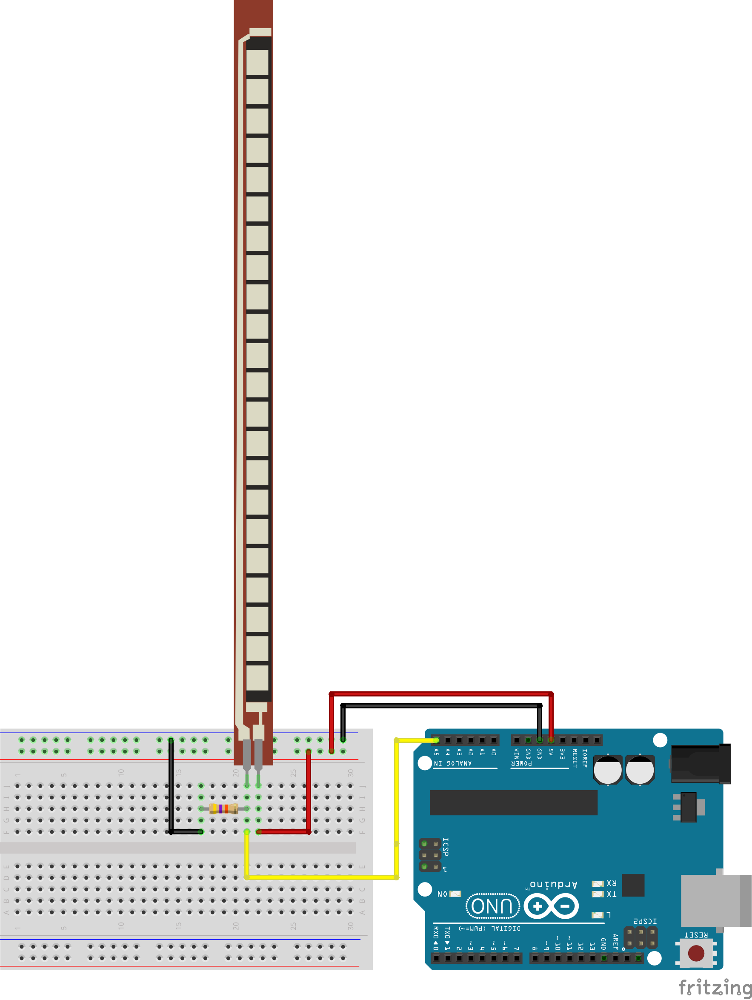
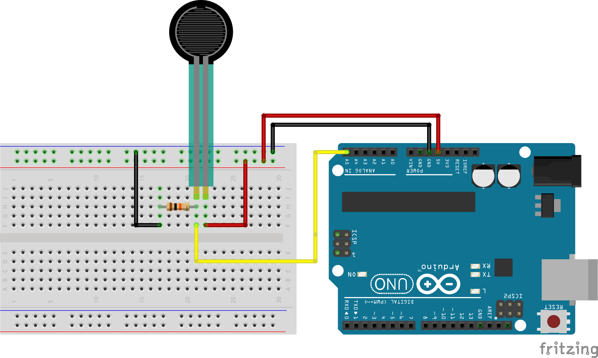
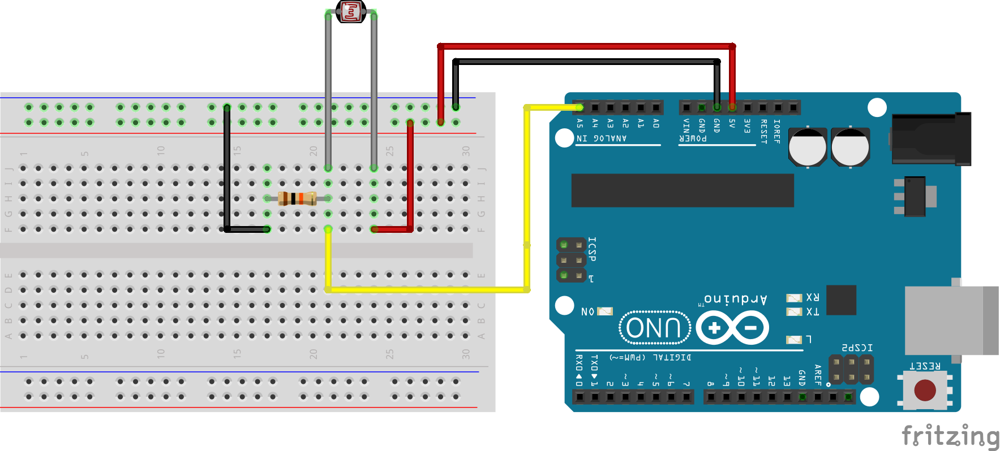
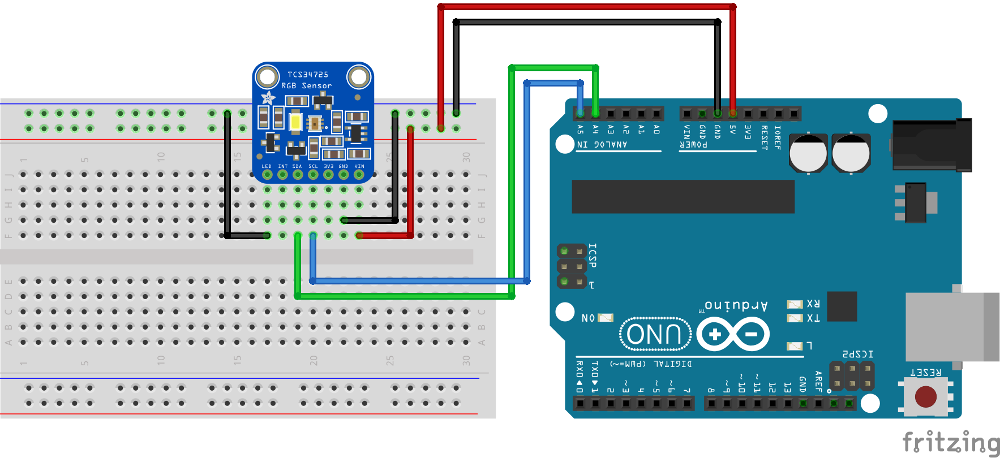
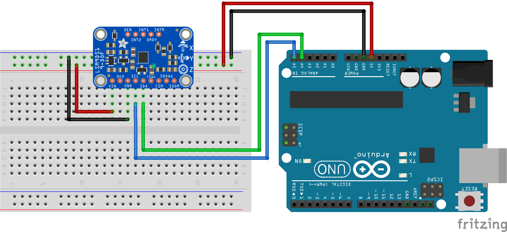

### Sensor Exploration and Data Collection

-----

Digital and analog sensors are affordable, accessible, and reliable tools for creating an embedded, computational awareness of the world. A huge variety of sensors exists for capturing all sorts of environmental, physical, and human phenomena. Sensors can be readily combined with one another to generate richer data.

-----

##### Recommended Base Kit

- [Arduino Starter Kit](https://www.amazon.com/Elegoo-EL-KIT-003-Project-Starter-Tutorial/dp/B01D8KOZF4/)

-----

##### Sensor Sources

- [Adafruit](https://www.adafruit.com/index.php?main_page=category&cPath=35)

- [Sparkfun](https://www.sparkfun.com/categories/23)

-----

##### Flex Sensor

A [flex sensor](https://www.amazon.com/Adafruit-Short-Flex-Sensor-ADA1070/dp/B00SK8PZVS/) uses conductive particles suspended in plastic to measure flexion.

-----

##### Force Sensor

A [piezo force sensor](https://www.amazon.com/Adafruit-Short-Flex-Sensor-ADA1070/dp/B00SK8PZVS/) uses the piezoelectric relationship between voltage and physical motion to measure impact and pressure.

https://www.amazon.com/Adafruit-Square-Force-Sensitive-Resistor-FSR/dp/B00SK694YE/

-----

##### Light Sensor

A [light dependent resistor](https://www.amazon.com/HOODDEAL-Sensitive-Resistor-Photoresistor-Optoresistor/)transforms incoming light and shadow into changing voltage.

-----

##### RGB Color Sensor

The [TCS34725 RGB Color Sensor](https://www.amazon.com/Adafruit-Color-Sensor-filter-White/dp/B00OKCRU5M/) shoots out white light and measures the wavelength intensity of the light that bounces back — returning red, green, and blue values.

-----

##### 9DOF Motion Sensor

The [LSM9DS1 9DOF Sensor](https://www.amazon.com/Adafruit-9-DOF-Accel-Breakout-Board/dp/B06XH5Y6DC/) measures linear and rotational acceleration, temperature, and the Earth's magnetic field to measure relative and absolute motion in three dimensions.

